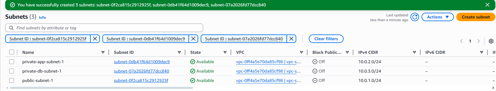
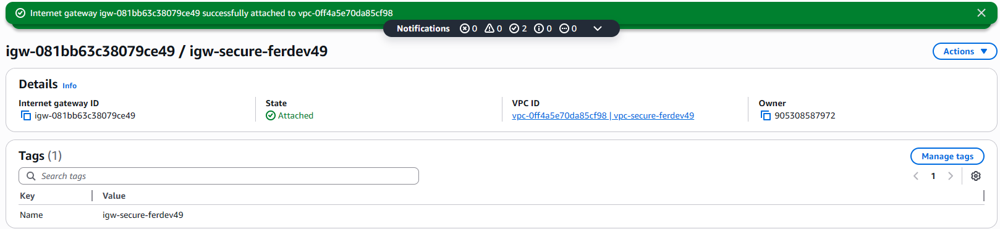
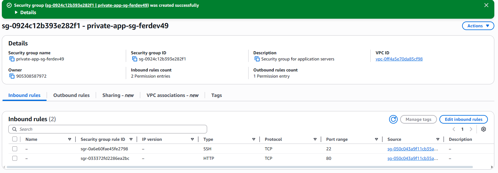

# 🛡️ Proyecto 1: Arquitectura VPC Segura desde Cero

## 🎯 Objetivo
Implementar una Virtual Private Cloud (VPC) en AWS con enfoque en **seguridad desde el diseño**, aplicando principios de mínimo privilegio y segmentación de red para proteger recursos en la nube.

## 📅 Información del Proyecto
- **Fecha:** 8 de diciembre 2025
- **Región AWS:** us-east-2 (Ohio)
- **Tiempo de ejecución:** 45 minutos
- **Costo total:** $0.00 (todos los recursos en Free Tier)
- **Estado:** ✅ Completado

## 🏗️ Arquitectura Implementada

### Diagrama de Red
![Arquitectura VPC Segura]
## 📸 Evidencia de Implementación

### Capturas de la Consola AWS
1. **VPC Creada** - 
2. **Subredes Configuradas** - 
3. **Internet Gateway Conectado** - 
4. **Route Table con Ruta a Internet** - 
5. **Security Groups Configurados** -   
6. **VPC Flow Logs Activos** - 

## 🧪 Prueba de Funcionalidad (Opcional - Por Realizar)

### Objetivo
Verificar que la VPC creada funciona correctamente y permite la conectividad controlada según las reglas de seguridad configuradas.

### Prueba Planeada
1. **Instancia EC2 de prueba** en `public-subnet-1`
2. **Verificación de conectividad** a Internet
3. **Validación de reglas de seguridad**
4. **Limpieza de recursos** para control de costos

### Recursos Necesarios
- Instancia EC2 t2.micro (Free Tier)
- Key Pair para conexión SSH
- 15 minutos de tiempo de ejecución

### Costo Estimado
- **Instancia EC2:** $0.0116/hora × 0.25 horas = $0.0029
- **Total estimado:** < $0.01 USD

### Componentes de Infraestructura
```yaml
VPC Principal:
  Nombre: vpc-secure-ferdev49
  CIDR Block: 10.0.0.0/16
  DNS Support: Enabled
  DNS Hostnames: Enabled

Subredes (Segmentación por función):
  - public-subnet-1:
      CIDR: 10.0.1.0/24
      AZ: us-east-2a
      Propósito: Recursos con IP pública
      Route Table: Asociada a Internet
  
  - private-app-subnet-1:
      CIDR: 10.0.2.0/24
      AZ: us-east-2a
      Propósito: Servidores de aplicación
      Acceso: Solo desde subred pública
  
  - private-db-subnet-1:
      CIDR: 10.0.3.0/24
      AZ: us-east-2b
      Propósito: Bases de datos aisladas
      Acceso: Solo desde subred de aplicación

Conectividad:
  Internet Gateway: igw-secure-ferdev49
  Route Table: rt-public-ferdev49
  Ruta configurada: 0.0.0.0/0 → Internet Gateway
